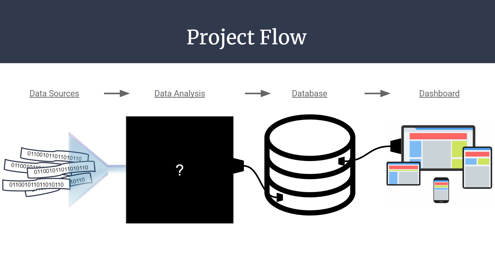
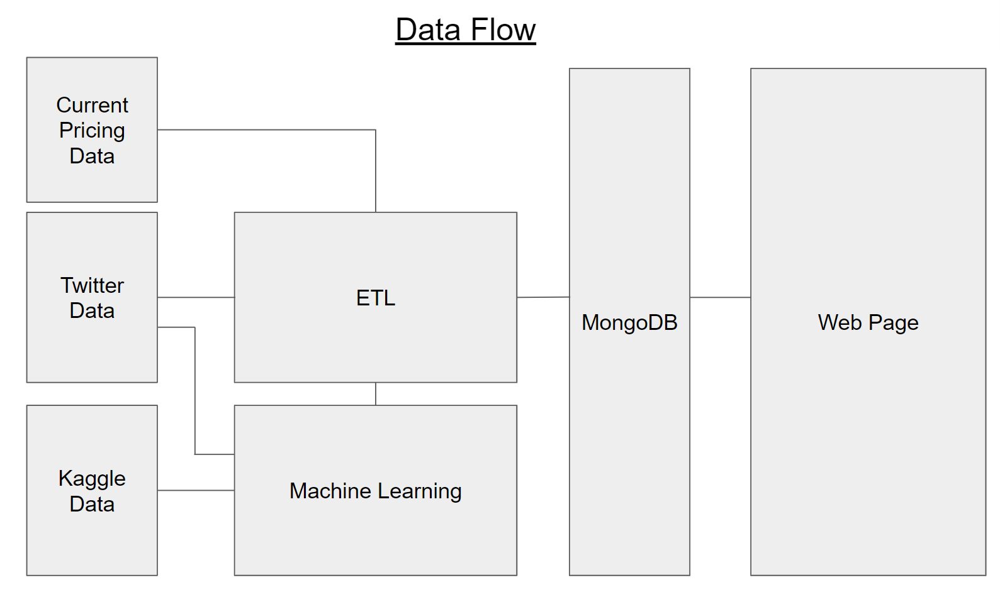
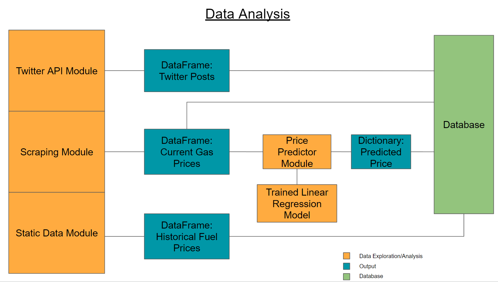
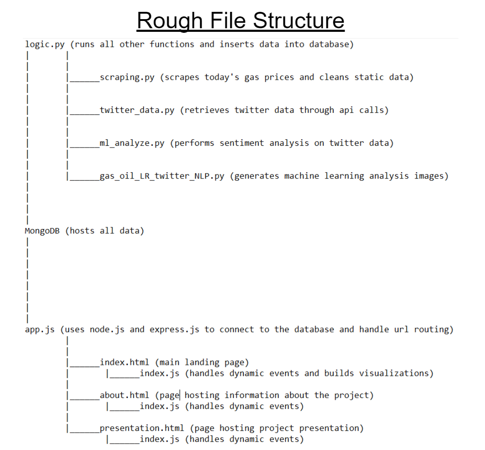
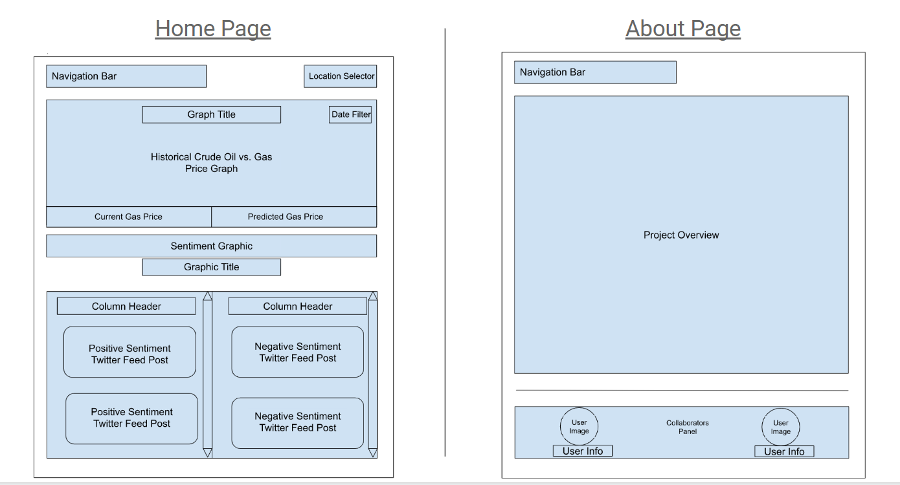

# **Gasoline Price Predictor**

## **Overview**

### About
In today’s modern world, fuel is an essential part of everyday life. It helps us get to work on time, receive packages when we order products online, fuels some of the machinery that helps grow our food, and does so many more things. However, in recent events, the price of fuel has seen significant fluctuation causing worries in the average American as the price begins to take a chunk out of their wallet. 

### Goal
The goal is to create a dashboard hosted on a webpage that will provides users with fuel related information. In particular, the dashboard will predict future gasoline prices and show a graphic representing user sentiment on twitter surrounding gasoline and oil. To compliment this information, some of the twitter posts will be showcased and the historical gasoline and oil data will be displayed on a line graph.

### Technologies Used
- Python
- Javascript
- MongoDB
- Supervised Learning: Linear Regression
- Natural Language Processing: Sentiment Analysis

### Current Status
12/7/2022 - This week the deliverables for Segment 2 were submitted. So far, the machine learning portions and data ETL have been completed, but lack integration with one another. Additionally, not all data has been programatically added to the database.

Some things to note are that:
- No join statement was performed as the data used in this project does not require joins and is stored in a noSQL database.
- The `twitter_data.py` file has not been integrated into the main logic. Therefore, its ouput is not currently being entered into the database.
- The machine learning models have not been converted and consolidated into one python file and are still in ipynb format.
- Some issues were encountered when merging, causing some of the file references to be incorrect. 
- `logic.py` and `scraping.py` should work and showcase the connection to the database. Just note that these files require a local connection to a mongodb instance to insert data into the database.

Having said that, the deliverables can be found in the following files:
- Presentation : clickable link in Readme.md
- Machine Learning Model: see `gas_oil_ML.ipynb` and `twitter_NLP.ipynb`
- Database: see `logic.py` and `scraping.py`
- Dashboard: see Dashboard section in Readme.md or Storyboard slide on presentation.

### Future Work
The next step is to integrate all our modules together and build out the webpage.
#### Future Work for Machine Learning Models
The next step for the linear regression machine learning model is to include a function that takes in current gas prices from AAA's website and predicts future gas prices. The next step for the sentiment analysis natural language processing model is to fix the "for loop" issue and generate predictions and an accuracy score. Currently, the models are merged into one python file, and will be updated once the next steps are complete.

 

### Presentation
Click [here](https://docs.google.com/presentation/d/10gvLuSyp35iwKA9KIDbKwRrCyrYTq0hdkg3Yi2Cu_y0/edit?usp=sharing) to see the presentation hosted on Google Slides.

 

## **Workflow**

### Project Outline
From a high level overview, static (e.g. downloaded) and live (e.g. scraping) data is being taken using python to then be fed to machine learning models to generate price predictions and evaluate sentiment polarity. All this pulled data and machine learning output is then connected and uploaded to a MongoDb database where it sits until the webpage needs it. Below are four figures increasing in specificity that outline how the project functions.

     
    Figure 1 (High Level Overview)

 

     
    Figure 2 (Data Flow)

 

     
    Figure 3 (Data Analysis Breakdown)

 

     
    Figure 4 (Rough File Structure)

### Communication Protocols

Tools: 
- Slack for instant messaging (IM).
- Zoom for audio and video communication.
- Google Drive and its ecosystem for document collaboration outside of Github.
- Github for code managment.

Protocols:
- Bi-weekly meetup for project progress check-up. Scheduled during class time.
- Assistance outside of meeting times is directed through IM on Slack. Further assistance may be requested through a Zoom meeting as needed.
- Main branch merges require review by other team members. The reviews may be conducted through Slack IM, Github review process, or on a Zoom meeting. 

 

## Machine Learning

### Linear Regression (see gas_oil_ML.ipynb)

#### Description of Preliminary Data Preprocessing
Starting with crude oil data (1983 to present) and gas and diesel price data (1995 to 2021), the data are cleaned to fit into a linear regression machine learning model.
The data are loaded into two dataframes (gas_df and crude_df). The cleaned gas price dataframe includes all formulations of retail gasoline and diesel prices in a MM/DD/YYYY format with samples from each month starting in January 1995 to January 2021. The cleaned crude oil dataframe is in the same format as the cleaned gas price dataframe: MM/DD/YYYY format with monthly samples from January 1995 to January 2021.

#### Description of Preliminary Feature Engineering and Preliminary Feature Selection
To fit a linear regression model with crude oil and gas price data to establish and explore relationships between the data.

#### Explanation of Model Choice, including Limitations and Benefits 
This linear regression model is the best model because historically, crude oil prices and gas prices have a linear relationship, so there is no need to complicate the relationship with other, more complex models.

#### Train, Test, Split Description 
The data are split into 80% training and 20% testing.

#### Explanation of Changes in Model Choice 
Not applicable.

#### Description of How the Model Has Been Trained Thus Far and Any Additional Training
This model will also include a function that takes in current gas prices (into the existing linear regression model with past gas prices) and predicts future gas prices.

#### Description of Current Accuracy Score
The current accuracy socre is 0.873. This will fluctuate once the function that takes in current gas prices to predict future gas prices is added.

#### How the Model Addresses the Question/Problem the Team is Solving 
This linear regression model will predict future gas prices in order to help American customers make more informed decisions about their gas consumption.

### Natural Language Processsing (Sentiment Analysis) (see twitter_NLP.ipynb)

#### Description of Preliminary Data Preprocessing
Using tweets from November 2022 to present, the data are cleaned and subjectivity and polarity score columns are included.

#### Description of Preliminary Feature Engineering and Preliminary Feature Selection
To use natural language processing to characterize the sentiment of current tweets on gas prices (positive, neutral, or negative sentiment).

#### Explanation of Model Choice, including Limitations and Benefits 
This sentiment analysis NLP model is useful to understand consumers' feedback and their needs. A, perhaps, better NLP model would be a BERT model. A BERT model has two tasks: language modeling and next sentence prediction, which is better for the context of tweets, rather than a simple positive, neutral, or negative sentiment.

#### Train, Test, Split Description 
The data are split into 80% training and 20% testing.

#### Explanation of Changes in Model Choice 
Based on the timeline of the project, a BERT model is unlikely to be implemented, even though it is a better NLP model.

#### Description of How the Model Has Been Trained Thus Far and Any Additional Training
The model is not running yet due to issues with a "for loop". Once the model is running, it will be trained to predict polarity scores, or emotions expressed, of tweets about gas prices.

#### Description of Current Accuracy Score
Not yet applicable.

#### How the Model Addresses the Question/Problem the Team is Solving 
This sentiment analysis natural language processing model will compliment the linear regression model by showcasing general sentiment about gas prices from tweets.

 

## Data Analysis

### The Data
We will be collecting data from multiple locations:

+ [Twitter](https://twitter.com/) - Number of Tweets, Gas + Oil Tweets
+ [Statistica](https://www.statista.com/) - Historic Gas + Diesel Prices
+ [AAA](https://gasprices.aaa.com/) - Current Gas + Diesel Prices
+ [Kaggle](https://www.kaggle.com/datasets/sc231997/crude-oil-price) - Historic Crude Oil Prices

### Scraping Twitter
Twitter is an American social networking service where individuals can microblog in a form of "Tweet". There are many limitations of accessing Twitter. Twitter's API allows access to recent data up to a week old and retrieve 500,000 Tweets per month. We will be scraping all Tweets that include the words: "gas" and "oil".

To scrape the data from Twitter, we created a Twitter account and applied to access the API. Once we got accepted, we used the API key to connect to Twitter. We were able to collect the number of Tweets and all Tweets that included the words: "gas" and "oil" from the past seven days.

In order to grab data longer than seven days from Twitter, we scraped new Tweets every day and added it to the previous combined data (`tweets.csv` and `tweet_count.csv`).

### Scraping AAA + Statistica
We were able to access the historic gas and diesel prices from Statistica. From there we needed to scrape AAA to get the current gas prices. Similar to the process of scraping Twitter, we added the new data from AAA to the historic data from Statistica to create the current gas price data.

## Database

 

## Dashboard
Two web pages will be created to host the data visualizations. Therefore, a web stack will be utilized to build the web pages. A connection will be made to the MongoDB database which will pass data to a javascript file. After the javascript file has handled the data (e.g. create line graph) the data/visualizations will finally be passed to the html webpage for display.

### Tools & Uses
- HTML5 - Page layout.
- CSS3 - Page styling.
- Plotly.js - Fuel price line graph & sentiment graphic.
- Node.js - Database connection.
- JavaScript - Handle dynamic content (e.g. click events).

### Interactive Elements
- Navigation Bar- clickable links allowing navigation between the About page and the Home page.
- Date Filter- clickable graph filter allowing user to select date range between 1 month, 3 months, 6 months, or 1 year.
- Twitter Post - clickable links directing the user to the original twitter post on Twitter.
- User Info - clickable link redirecting the user to the respective collaborator’s github page.

     
    Figure 5 (Storyboard)

