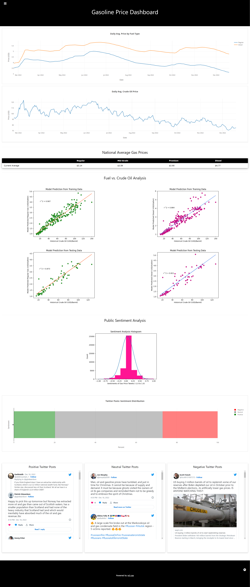

# **Gasoline Price Dashboard**

## **Overview**

### About
In today’s modern world, fuel is an essential part of everyday life. It helps us get to work on time, receive packages when we order products online, fuels some of the machinery that helps grow our food, and does so many more things. However, in recent events, the price of fuel has seen significant fluctuation causing worries in the average American as the price begins to take a chunk out of their wallet. 

### Goal
The goal is to create a dashboard hosted on a webpage that will provide users with fuel related information. In particular, the dashboard will focus on two sub-topics.
1. Analyze the relationship between Crude Oil & Gasoline Prices using a linear regression model.
2. Identify the sentiment in twitter posts and determine if sentiment can reliably be extracted from the posts.

### Technologies Used
- Python
- Javascript
- MongoDB
- Supervised Learning: Linear Regression (sci-kit learn)
- Natural Language Processing: Sentiment Analysis (textblob)

 

### Running the Project
If you would like to run this project on your machine please refer to the `GetStarted.txt` file to see what software is required and how to run the dashboard.

### Presentation
Click [here](https://docs.google.com/presentation/d/10gvLuSyp35iwKA9KIDbKwRrCyrYTq0hdkg3Yi2Cu_y0/edit?usp=sharing) to see the presentation hosted on Google Slides.

### Dashboard
Click [here](https://youtu.be/iJ34HNs7qag) for a walkthorugh of our dashboard on YouTube.

## **Project Structure**

### High Level Overview (See Figure 1)
- We start with data sources which represent the process of taking the raw data from various sources and preparing it to be suitable for analysis.
- Then, the data sources are fed into the mysterious black box which represents the process taken to extract the information that will be presented in our dashboard. 
- Once the right information has been generated, all of it is inserted into a NoSQL database which acts like a barrier between the data gathering and the data visualization. The database fully separates the two. The dashboard does not talk to the code analyzing the data; it simply pulls what has already been analyzed and inserted into the database.
- Finally, the dashboard is generated in a web page format.

     
    Figure 1 (High Level Overview)

 

### Data Flow (See Figure 2)

- Current Pricing Data - this data is scraped and cleaned before being fed to the linear regression model to aggregate with the historical data. Additionally, this data flows directly to the database for plotting on the webpage.
- Twitter Data - this data is pulled from the Twitter api and cleaned before being passed to the sentiment analysis model. Once the sentiment score is added it goes back one more time through the ETL process before going into the database.
- Kaggle Data - this data is downloaded statically and provided to the machine learning model to provide the bulk of the historical data that will be used in the linear regression model.

     
    Figure 2 (Data Flow)

 

### File Structure (See Figure 3)
The project has two sides, the python side where data is gathered and the javascript side where data is visualized. These two sides are divided by the database and don't interact with each other. 

In the python side, the structure centralizes around the `logic.py` file which calls and retrieves the information from all the other functions hosted on the various python modules. One thing to note here, is that we currently have two files that involve machine learning `ml_analyze.py` and `gas_oil_LR_twitter_NLP.py`. The intent was for ml_analyze.py to generate the machine learning analysis images and attach the sentiment score to the tweet data datframe. However, currently `ml_analyze.py` handles appending the score  to the dataframe and `gas_oil_LR_twitter_NLP.py` generates all the machine learning images which are statically hosted in the `public/images` folder.

     
    Figure 3 (Rough File Structure)

 

## Machine Learning (see gas_oil_LR_twitter_NLP.py)

 

### Linear Regression Models for both Gas and Diesel (see gas_oil_ML.ipynb)
Two linear regression models were created: one to predict __regular gas prices from crude oil prices__ and the other to predict __diesel prices from crude oil prices__. 

#### Description of Preliminary Data Preprocessing
Starting with historical crude oil data (1983 to 2021) and historical gas and diesel price data (1995 to 2021), the data are cleaned to fit into a linear regression machine learning model and loaded into two dataframes (hist_crude_df and hist_gas_df).
The cleaned gas price dataframe includes all formulations of retail gasoline and diesel prices in a MM/DD/YYYY format with samples from each month starting in January 1995 to January 2021. The cleaned crude oil dataframe is in the same format as the cleaned gas price dataframe: MM/DD/YYYY format with monthly samples from January 1995 to January 2021.
Using current crude oil data (February 2021 to December 2022) and current gas and diesel price data (January 2021 to December 2022), the data are cleaned to line up with the historical dataframes' formatting. The data are loaded into two dataframes (current_crude_df and current_gas_df). Once the four dataframes (historical and current and crude oil and gas) were accurately cleaned, the data were loaded into two dataframes (gas_df and crude_df).

#### Description of Preliminary Feature Engineering and Preliminary Feature Selection
To fit a linear regression model with historical and current crude oil and gas price data (and then fit a model with historical and current crude oil and diesel price data) to establish and explore relationships between the data.

#### Explanation of Model Choice, including Limitations and Benefits 
This linear regression model is the best model because historically, crude oil prices and gas prices have a linear relationship, so there is no need to complicate the relationship with other, more complex models.

#### Train, Test, Split Description 
The data are split into 80% training and 20% testing.

#### Explanation of Changes in Model Choice 
Not applicable.

#### Description of How the Model Has Been Trained Thus Far and Any Additional Training
After adding AAA current gas price data and MarketWatch's current crude oil prices and data cleaning, this model now includes a function that takes in current gas prices (into the existing linear regression model with past gas prices) and predicts future gas prices.

#### Description of Current Accuracy Score
The current accuracy score is 0.0906 with the current gas and crude oil prices included. Previously, the model's accuracy score was 0.903 (after taking in current gas prices), and before, with just historical crude and gas prices, the accuracy was 0.873). The r-squared for the regular gas model prediction from training data is 0.907 and the r-squared from testing data is 0.873. The r-squared for the diesel model prediction from training data is 0.864 and the r-squared from testing data is 0.821.

Since confusion matrices cannot be done on regressors, neither of these models have them. 

#### How the Model Addresses the Question/Problem the Team is Solving 
This linear regression model will predict current gas and diesel prices in order to help American customers make more informed decisions about their fuel consumption.

 

### Natural Language Processsing (Sentiment Analysis) (see twitter_NLP.ipynb)

#### Description of Preliminary Data Preprocessing
Using tweets from November 24, 2022 to December 5, 2022, the data are cleaned and subjectivity and polarity score columns are included.

#### Description of Preliminary Feature Engineering and Preliminary Feature Selection
To use natural language processing to characterize the sentiment of current tweets on gas prices (positive, neutral, or negative sentiment, ranging from -1.0 to 1.0).

### Explanation of Model Choice, including Limitations and Benefits
This sentiment analysis NLP model provides a sentiment score for those who tweeted about gas and oil from November 24, 2022 to December 5, 2022. To understand the sentiment of current consumers, current data would need to be added. To include this sentiment analysis in the linear regression machine learning model, we would need more data, organized by month. Due to the limitations of the data and the data preprocessing of the linear regression model, there are only gas and diesel prices by month from January 1995 to January 2021 and February 2022 to December 2022. As a result, adding this sentiment analysis to the other model would only be adding two data points: November and December 2022 tweets.

### Train, Test, Split Description
Since the tweet data are limited to November and December, they cannot be meaningfully added to the linear regression model, so there is no training set or testing set.

### Explanation of Changes in Model Choice & Description of How the Model Has Been Trained Thus Far and Any Additional Training
Based on the formatting of the tweets and gas prices, the model went from attempting to predict current sentiment of gas prices to characterizing the sentiment from the last week in November to the first week in December.

### Description of Current Accuracy Score
Not applicable.

### How the Model Addresses the Question/Problem the Team is Solving
This sentiment analysis natural language processing model will compliment the linear regression model by showcasing general sentiment about current gas prices from tweets.

 

## Collecting Data
We will be collecting data from multiple locations:

+ [Twitter](https://twitter.com/) - Number of Tweets, Gas + Oil Tweets
+ [Statistica](https://www.statista.com/) - Historic Gas + Diesel Prices
+ [AAA](https://gasprices.aaa.com/) - Current Gas + Diesel Prices
+ [Kaggle](https://www.kaggle.com/datasets/sc231997/crude-oil-price) - Historic Crude Oil Prices
+ [MarketWatch](https://www.marketwatch.com/investing/future/cl.1) - Current Crude Oil Prices

### Scraping Twitter (twitter_data.py)
Twitter is an American social networking service where individuals can microblog in a form of "Tweet". There are many limitations of accessing Twitter. Twitter's API allows access to recent data up to a week old and retrieve 500,000 Tweets per month. We will be scraping all Tweets that include the words: "gas" and "oil".

To scrape the data from Twitter, we created a Twitter account and applied to access the API. Once we got accepted, we used the API key to connect to Twitter. We were able to collect the number of Tweets and all Tweets that included the words: "gas" and "oil" from the past seven days.

In order to grab data longer than seven days from Twitter, we scraped new Tweets every day and added it to the previous combined data (`tweets.csv` and `tweet_count.csv`).

    Figure 4 (Tweepy Process)

### Gas & Diesel Prices (scraping.py)
We were able to access the historic gas and diesel prices from Statistica. From there we needed to scrape AAA to get the current gas prices. BeautifulSoup is a Python package for parsing HTML and XML documents. It creates a parse tree for parsed pages that can be used to extract data from HTML, which is useful for web scraping. By using this package and the HTML source code from the webpage, we were able to extract the current price of gasoline and diesel. Similar to the process of scraping Twitter, we added the new data from AAA to the historic data from Statistica to create the current gas price data.

### Crude Oil Prices (scraping.py)
To access the current crude oil prices, we scraped the closing price oil on MarketWatch. MarketWatch is a website that provides financial information, business news, analysis, and stock market data. Since the crude oil prices are updated along with the stock exchange, the data does not include weekends. This follows a similar process to scraping the gas & diesel prices.

    Figure 5 (Scraping Process)

## Database

For the database a NoSQL model was used, in particular MongoDB. MongoDB was selected as originally, the plan was to generate the images associated with the machine learning analysis in python and save the images into the database.Thus, necessitating the need for a NoSQL model.

Additionally, the other data that was being inserted did not require complex lookups or joins so using an SQL database did not provide any additional benefits.

Ultimately, however, due to time constraints the generated images were linked directly on the webpage instead of being passed through the database. Rendering the use of a NoSQL model a moot point.

Nonetheless, as MongoDB was our database of choice, we utilized PyMongo to insert our data thorugh python and used the MongoDB driver for node.js to retrive the data in javascript.

See the code in `logic.py` and `app.js` to see the code interacting with the database.

 

## Dashboard
Four web pages were created with the following purposes.

- `index.html` : hosts all the data visualizations. 
- `about.html` : provides information about the project.
- `presentation.html` :  hosts an embeded version of the google slides presenation used for this project.
- `404.html` : web page that is returned when an unexpected route is passed to the backend.

### Tools & Uses
- HTML5 - Page layout.
- CSS3 - Page styling.
- Plotly.js - Fuel price line graph & sentiment graphic.
- Node.js - Database connection.
- Express.js - Middleware for handling url routes.
- JavaScript - Handle dynamic content (e.g. click events).

### Interactive Elements
- Navigation Bar- clickable links allowing navigation between the About page, Presentation Page and the Home page.
- Twitter Post - clickable links directing the user to the original twitter post on Twitter.
- Line and Bar Charts - interactive elements natively available from plotly.js

### Storyboard
The website design was originally storyboard to be comprised of only two web pages with the layouts seen in Figure 6. In the final iteration of our project, this was changed to be three pages with the main page having a drastically different look as seen in Figure 7.

     
    Figure 6 (Original Storyboard)

 

     
    Figure 7 (Home Page)

